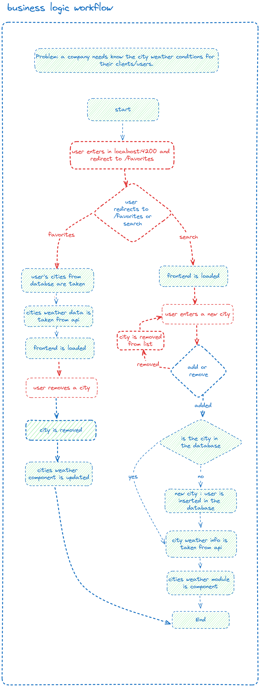
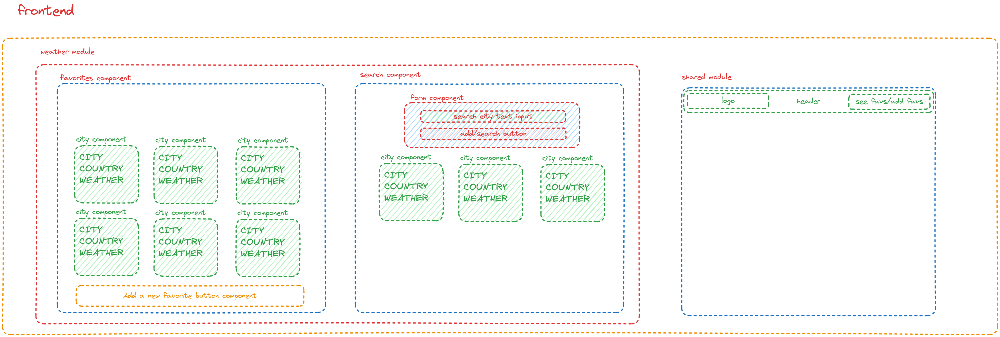
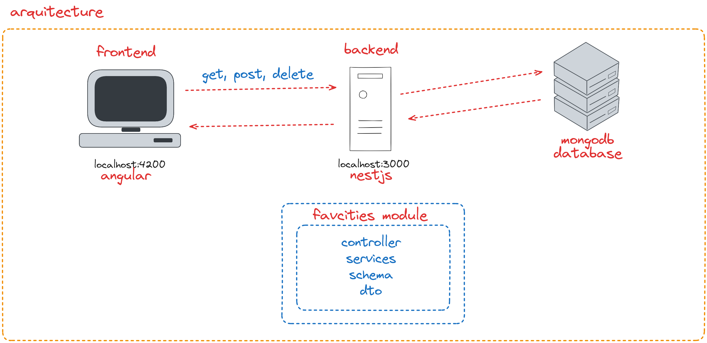

## Description of the project
This project was generated with [Angular CLI](https://github.com/angular/angular-cli) version 17.2.2. and it is part of a test created by MushroomSoft (Frontend).
A company needs know the city weather conditions for their clients/users. The logic workflow is presented in the following image:



The modules are the following:


The arquitecture selected is Client-Server to keep things super simple and it is the following:



## Installation

```bash
$ npm install
```

## Running the app

```bash
# development
$ npm run start

# watch mode
$ npm run start:dev

# production mode
$ npm run start:prod
```

## Test

```bash
# unit tests
$ npm run test

# e2e tests
$ npm run test:e2e

# test coverage
$ npm run test:cov
```

## Support

Nest is an MIT-licensed open source project. It can grow thanks to the sponsors and support by the amazing backers. If you'd like to join them, please [read more here](https://docs.nestjs.com/support).

## Stay in touch

- Author - [Kamil Myśliwiec](https://kamilmysliwiec.com)
- Website - [https://nestjs.com](https://nestjs.com/)
- Twitter - [@nestframework](https://twitter.com/nestframework)

## License

Nest is [MIT licensed](LICENSE).
